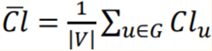
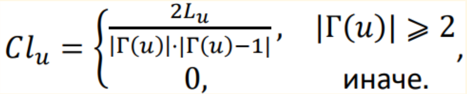
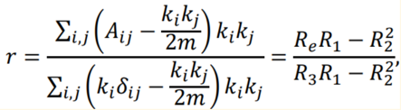

# Сomputing features for static graphs and Supervised temporal link prediction for temporal networks
### (Link prediction based on paper "Supervised temporal link prediction in large‑scale real‑world networks" Gerrit Jan de Bruin,Cor J. Veenman, H. Jaap van den Herik, Frank W. Takes)

- Start testing on datasets (temporal graphs in datasets directory) - ``` python main.py``` 
- Start testing on test graphs (calculate only feature for not temporal graphs)- ```./run_test.sh```

### How to start
To test your dataset, write the path to your file in the main.py file in Networks, and enter information about your graph 
in datasets_info, then you can take a slice using iloc to test only for your dataset. 
(See how the data path is registered for other files!). 
At the output, you will get 4 latex plates with graph features and auc score for the task of predicting missing edges.

### Feature calculation
First, we computed for each edge 3 weights from its timestamp.
Then for each node we take the edges adjacent to it, that is, we get 3 lists of weights of adjacent edges 
(so the edge has 3 weights and the lists contain weights calculated using one formula), 
then we apply one of 7 functions to the resulting list: quantiles, sum , average. 3 lists, 7 aggregation functions -> 21 numbers. 
These 21 numbers are signs of node activity (because we took edges adjacent to a certain node)
Thus, each node has 21 features. Now you need to define a feature description for an edge, an edge connects 2 vertices, 
2 vertices have a feature description, then we combine the features of these two vertices using 4 functions, 
that is, each feature of the first vertex with each feature of the second vertex, i.e. 21 * 4 = 84

### Properties of networks (for static graphs)
1. The following characteristics are calculated for each of the networks:
* the number of vertices,
* the number of ribs,
* density (the ratio of the number of ribs to the maximum possible number of ribs),
* the number of components of weak connectivity,
* the fraction of vertices in the maximum power component of weak connectivity.
2. For the largest component of weak connectivity the values of radius, network diameter, 90th percentile distance (geodesic) between graph vertices are calculated/estimated.
The evaluation is conducted on the basis of:
* Calculate distances between 500 (1000) randomly chosen vertices from the largest component of weak connectivity;
* Calculate distances by a snowball sample subgraph constructed by the following principle: a small initial set of vertices (2 or 3) is chosen, then all their neighbors are added, then neighbors of neighbors, etc., until the number of vertices in the subgraph equals (approximately) a given value (for example, 500 or 1000).
3. For the largest component of weak connectivity the average cluster coefficient of the network is calculated





Г(u) - set of neighbors of the vertex

|Г(u)| - degree of the vertex

Lu - number of edges between neighbors

4. Assortativity coefficient by degree of vertices -1 ≤ 𝑟 ≤ 1 (Pearson correlation coefficient)



The case when in the network the vertices of small degree are connected to the vertices of large degree more often corresponds to the negative values of the coefficient 𝑟 < 0.

### Predicting the appearance of edges in a graph
For prediction it is necessary first to construct a feature description for each potential edge (vector/set of features) 𝑋(𝑢,𝑣) , and the answer 𝑦(𝑢,𝑣) , which takes the value 𝑦(𝑢,𝑣) = 1 if the edge appears in the graph, and 𝑦(𝑢,𝑣) = 0 otherwise. 

A. Construction of feature vectors to predict the appearance of edges in a graph

The paper proposes several options for constructing a feature description, and then compares the quality of the resulting predictions. For this implementation, a set of III

Б. Binary classification.

Logistic regression algorithm is used to train the model. To evaluate the quality of the built model the metric AUC (Area Under the Receiver Operating Curve) is used - the area under the ROC AUC curve.

ROC AUC - the curve is constructed based on the ratio of the proportion of objects correctly classified with some property (TPR true positive rate) and the proportion of objects without the property, but misclassified as having this property (FPR false positive rate), at different levels of the decision threshold.

TPR - the fraction of edges that appeared in the column 𝑦(𝑢,𝑣) = 1 and which the classifier marked as having appeared in the column.

FPR - the fraction of edges that did not appear in the column, but were marked as appearing.

### Parameters for splitting the edges of a temporary network into a feature generation part and an occurrence prediction part

Based on 2/3 of the time graph, we build an indicative description of the edges that are missing in this part, 
then we look at 1/3 of the graph whether an edge has appeared or not, if so, then the label is 1, otherwise 0.

### Dividing the sample into training and test

2/3 parts of the graph from the previous paragraph are divided in the ratio of 75 to 25 into training and test, respectively, 
this partition generates a partition in 1/3 of the graph